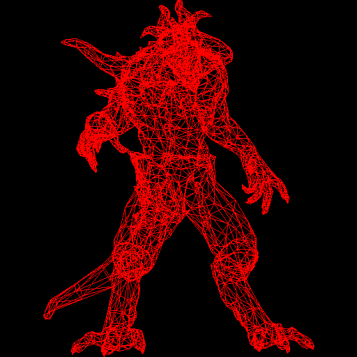

# renderer-from-scratch

Work in progress. A software renderer in C, following the [tinyrenderer](https://haqr.eu/tinyrenderer/).



## Build

```bash
make build
make run
```

Output is written to `output/`.

## Dependencies

None. Only the C standard library.
